# AGOUTIC Architecture — Visual Overview (v3.6.2)

> Presentation-ready diagrams for **AGOUTIC v3.6.2**, an agentic bioinformatics
> platform that orchestrates genomic data portal queries (ENCODE, IGVF),
> Nextflow pipeline execution (local and HPC/SLURM), differential expression,
> gene enrichment, and cross-workflow analysis through natural-language
> conversation.
>
> **Audience:** bioinformatics researchers, computational biologists, and
> reviewers evaluating the system architecture.
>
> **Tip:** Each diagram is self-contained and sized for a single PowerPoint
> slide or manuscript panel. Use the Mermaid CLI or a live editor to export
> SVG/PNG at 300 DPI.

---

## 1 — System Architecture

Six MCP micro-services communicate over stateless JSON-RPC 2.0.
The Streamlit UI connects only to Cortex; all downstream services are
abstracted behind the orchestrator.

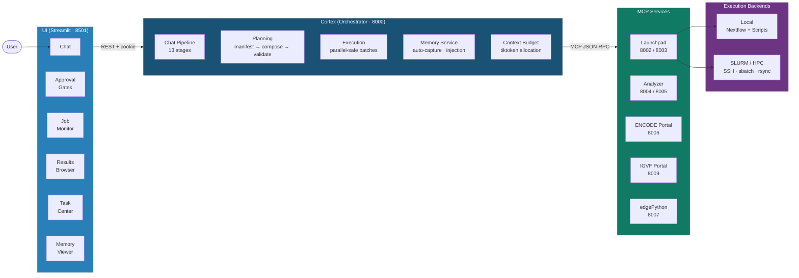

---

## 2 — Chat Pipeline (13 Stages)

A user message enters Cortex and flows through a priority-ordered pipeline
of self-registering stages. Any stage can short-circuit the pipeline
(e.g., `/memories` returns immediately at stage 230). The pipeline replaced
a monolithic 1,600-line function with 13 focused modules.

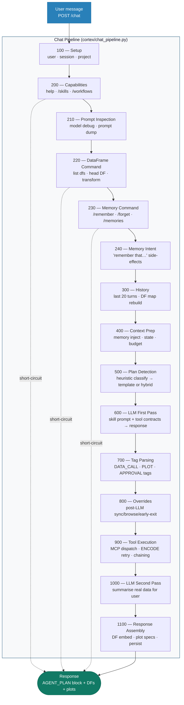

---

## 3 — Skill Manifests & Planning

Skills are defined as YAML manifests (`skills/<key>/manifest.yaml`) that
declare triggers, required services, MCP tool chains, and input/output types.
The planner attempts manifest-driven composition first, falling back to
deterministic templates for unmigrated flows.

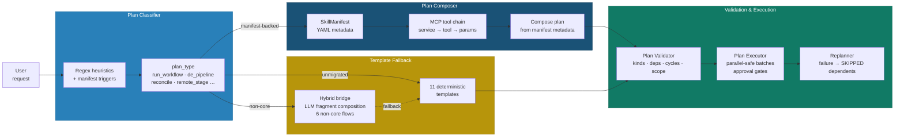

---

## 4 — Dual Consortium Data Access (ENCODE + IGVF)

AGOUTIC queries two major genomic data portals through dedicated MCP servers.
Both are registered in the consortium registry and accessed identically via
DATA_CALL tags. Natural-language routing auto-detects which portal to query.

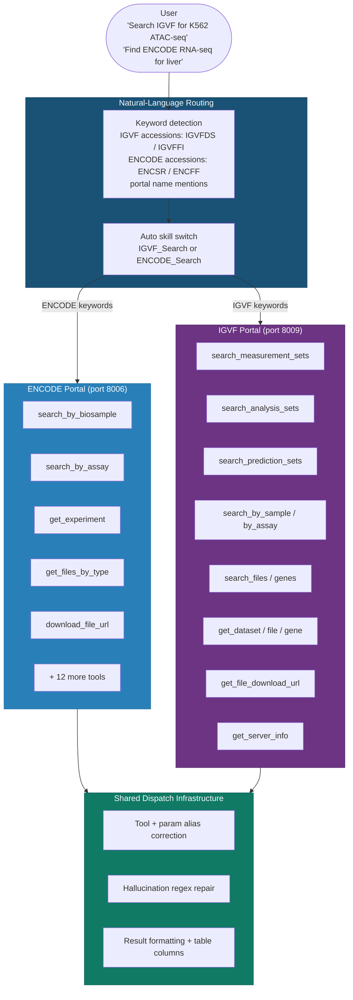

---

## 5 — Skill System & Domain Coverage

Each skill lives in `skills/<key>/` with a `SKILL.md` prompt, an optional
`manifest.yaml` for planner metadata, and an optional `scripts/` directory
for allowlisted utilities. Skills are grouped by biological function and
mapped to backend MCP services.

```mermaid
graph TB
    subgraph data ["Data Access"]
        ES["ENCODE Search"]
        EL["ENCODE Long Read"]
        IS["IGVF Search"]
        DL["Download Files"]
    end

    subgraph exec ["Pipeline Execution"]
        DNA["Dogme DNA\nmethylation"]
        RNA["Dogme RNA\ndirect RNA"]
        CDNA["Dogme cDNA"]
        ALS["Local Sample\nIntake"]
        RE["Remote Execution\nHPC / SLURM"]
    end

    subgraph analysis ["Analysis & Interpretation"]
        AJR["Analyze Results\nQC · stats · BED"]
        DE["Differential\nExpression"]
        ENR["Enrichment\nGO · pathways"]
        RB["Reconcile BAMs\ncross-workflow"]
        XG["XGenePy"]
    end

    subgraph routing ["Service Backends"]
        ENCODE_S["ENCODE\nport 8006"]
        IGVF_S["IGVF\nport 8009"]
        LP_S["Launchpad\nport 8002"]
        AN_S["Analyzer\nport 8005"]
        EP_S["edgePython\nport 8007"]
    end

    ES & EL --> ENCODE_S
    IS --> IGVF_S
    ALS & RE & RB --> LP_S
    DNA & RNA & CDNA & AJR & ENR & XG --> AN_S
    DE --> EP_S

    style data fill:#2980b9,color:#fff,stroke:#2471a3
    style exec fill:#1a5276,color:#fff,stroke:#154360
    style analysis fill:#6c3483,color:#fff,stroke:#5b2c6f
    style routing fill:#117a65,color:#fff,stroke:#0e6655
```

---

## 6 — Execution Backends

The `ExecutionBackend` protocol provides a uniform interface for local and
remote job execution. Cortex and the UI remain backend-agnostic. Scripts run
through an allowlisted runner; remote staging runs as a durable background task.

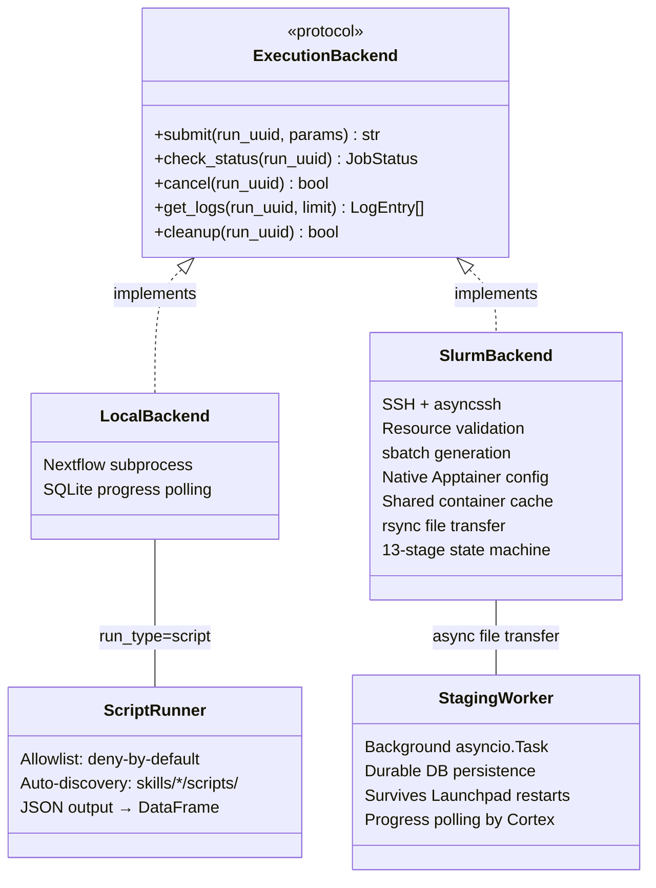

---

## 7 — HPC Remote Execution Lifecycle

Remote SLURM jobs follow a 13-stage state machine with enforced transitions.
Results are never marked complete until verified locally (fail-closed).
Staging now runs as a durable background task that survives HTTP timeouts
and Launchpad restarts.

```mermaid
stateDiagram-v2
    [*] --> awaiting_details

    awaiting_details --> awaiting_approval
    awaiting_approval --> validating_connection

    validating_connection --> preparing_remote_dirs
    preparing_remote_dirs --> transferring_inputs

    transferring_inputs --> submitting_job

    submitting_job --> queued
    queued --> running

    running --> collecting_outputs
    collecting_outputs --> syncing_results

    syncing_results --> completed

    awaiting_details --> cancelled
    awaiting_approval --> cancelled
    validating_connection --> failed
    transferring_inputs --> failed
    submitting_job --> failed
    running --> failed
    syncing_results --> failed

    state transferring_inputs {
        [*] --> background_rsync
        background_rsync --> progress_polling
        progress_polling --> transfer_done
        note right of background_rsync : Durable staging worker\nsurvives HTTP timeouts\nand Launchpad restarts
    }

    state completed {
        [*] --> outputs_verified
        outputs_verified --> auto_analysis
        note right of outputs_verified : Fail-closed:\nresults verified on disk\nbefore marking complete
    }
```

---

## 8 — Memory System

AGOUTIC maintains persistent memory across conversations with both project
and global scope. Memories are auto-captured from pipeline steps and results,
injected into LLM context with token-budgeted priority, and queryable via
slash commands or natural language.

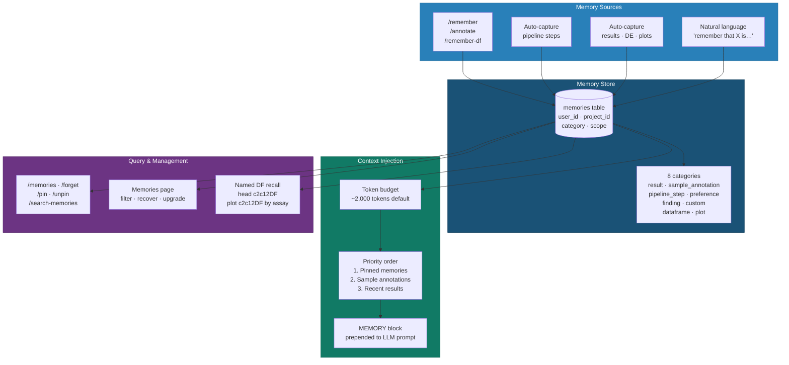

---

## 9 — End-to-End Bioinformatics Workflow

A complete session from data discovery through pipeline execution to
biological interpretation. Diamonds are human approval gates. Safe steps
run in parallel; failures trigger the replanner.

```mermaid
flowchart TB
    Start(["User: 'Find RNA-seq for K562,\nrun Dogme RNA on the cluster,\nthen differential expression'"])

    subgraph p1 ["1  Data Discovery"]
        Search["Search ENCODE or IGVF\nbiosample · assay · target"]
        Browse["Interactive DataFrame\nfilter · sort · select"]
    end

    DL{"Approve\ndownload?"}

    subgraph p2 ["2  Stage to HPC"]
        Download["Download files"]
        Cache["Cache check\nreference already staged?"]
        Stage["Background rsync\ndurable staging worker"]
    end

    Submit{"Approve\nSLURM job?"}

    subgraph p3 ["3  HPC Execution"]
        Validate["Resource validation\nCPU · RAM · GPU · walltime"]
        Sbatch["sbatch submit\nNextflow + Apptainer"]
        Poll["SLURM monitoring\n13-stage tracking"]
        Sync["Result sync\nselective rsync to local"]
    end

    subgraph p4 ["4  Analysis"]
        QC["QC & stats parsing"]
        Reconcile["Reconcile BAMs\nacross workflows"]
        DE["Differential expression\ngrouped from abundance"]
        Enrich["GO & pathway\nenrichment"]
        Plots["Plots: volcano · MA\nheatmap · enrichment"]
        Summary["LLM interpretation\nresults → memory"]
    end

    Start --> Search --> Browse --> DL
    DL -->|Yes| Download --> Cache --> Stage --> Submit
    Submit -->|Yes| Validate --> Sbatch --> Poll --> Sync
    Sync --> QC --> Reconcile --> DE --> Enrich --> Plots --> Summary

    style p1 fill:#2980b9,color:#fff,stroke:#2471a3
    style p2 fill:#1a5276,color:#fff,stroke:#154360
    style p3 fill:#6c3483,color:#fff,stroke:#5b2c6f
    style p4 fill:#117a65,color:#fff,stroke:#0e6655
```

---

## 10 — Security Model

Security is enforced at every layer. No raw credentials are stored.
All destructive operations require explicit user approval.

```mermaid
flowchart LR
    subgraph auth ["Authentication"]
        OAuth["Google OAuth 2.0"]
        Session["Session tokens\n72h expiry · heartbeat"]
        Admin["Admin user approval"]
    end

    subgraph access ["Access Control"]
        RBAC["Project RBAC\nowner · editor · viewer"]
        Jail["User Jail\npaths ⊂ users/name/project/"]
        Traversal["Path traversal\nblocked"]
    end

    subgraph gates ["Approval Gates"]
        JobGate["Job submission"]
        DLGate["Data download"]
        RemoteGate["Remote execution"]
        ScriptGate["Script allowlist\ndeny-by-default"]
    end

    subgraph hpc ["HPC Isolation"]
        NoStore["No raw keys stored"]
        Broker["Auth broker\nper-session · 0600 · timeout"]
        Audit["Audit log\nno secrets recorded"]
    end

    subgraph validation ["Input Validation"]
        Schema["Tool param validation"]
        PlanCheck["Plan contract check"]
        Resource["SLURM resource limits"]
        ModeDrift["Mode/path drift\nrejection"]
    end

    auth --> access --> gates --> hpc
    gates --> validation

    style auth fill:#2980b9,color:#fff,stroke:#2471a3
    style access fill:#1a5276,color:#fff,stroke:#154360
    style gates fill:#b7950b,color:#fff,stroke:#9a7d0a
    style hpc fill:#6c3483,color:#fff,stroke:#5b2c6f
    style validation fill:#922b21,color:#fff,stroke:#7b241c
```

---

## 11 — Context Budget & Token Management

The LLM context window is allocated across six priority-ranked slots using
tiktoken for accurate token counting. This prevents context overflow and
ensures the most relevant information reaches the model.

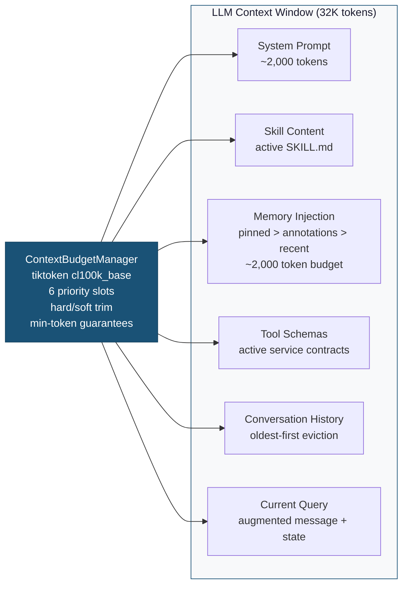

---

*Generated for AGOUTIC v3.6.2 — April 2026*
# AGOUTIC Architecture — Visual Overview

> Eight diagrams illustrating the architecture of **AGOUTIC v3.4.9**, an agentic
> bioinformatics platform that orchestrates ENCODE data retrieval, Nextflow
> pipeline execution (local & HPC/SLURM), differential expression analysis,
> and gene enrichment through natural-language conversation.

---

## 1. Service Architecture

Five MCP (Model Context Protocol) micro-services communicate over stateless
JSON-RPC 2.0. The Streamlit UI talks exclusively to **Cortex**, which fans out
to specialised backends. No service ever bypasses the orchestrator. Cortex
itself is decomposed into focused modules — chat orchestration, planning,
execution, tool dispatch, and remote orchestration each live in their own file.

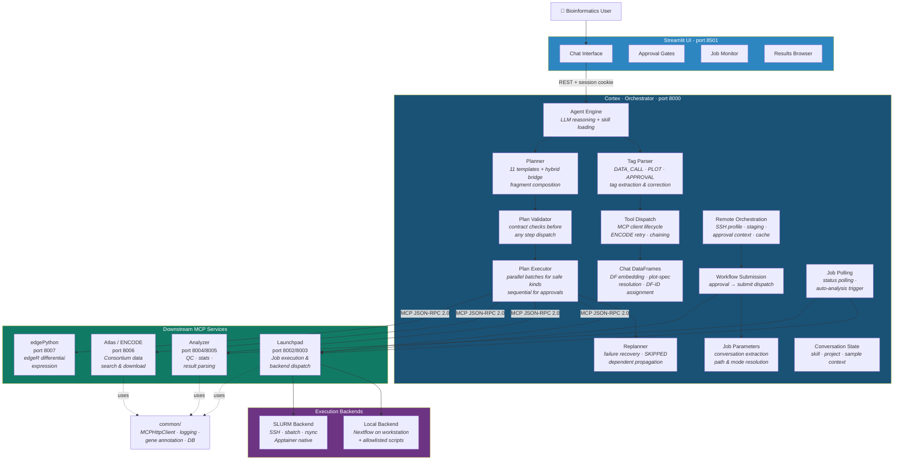

---

## 2. Agent Intelligence — Two-Pass LLM Architecture

The agent uses a **two-pass architecture** that separates fast classification
from careful execution, ensuring the system never improvises on safety-critical
steps. Skill files (Markdown) encode domain workflows in a per-skill directory
layout (`skills/<key>/SKILL.md`); tool contracts give the LLM precise parameter
schemas. Multi-step requests now go through a **hybrid planning bridge** that
attempts LLM fragment composition first for six non-core flows, falling back to
deterministic templates on failure.

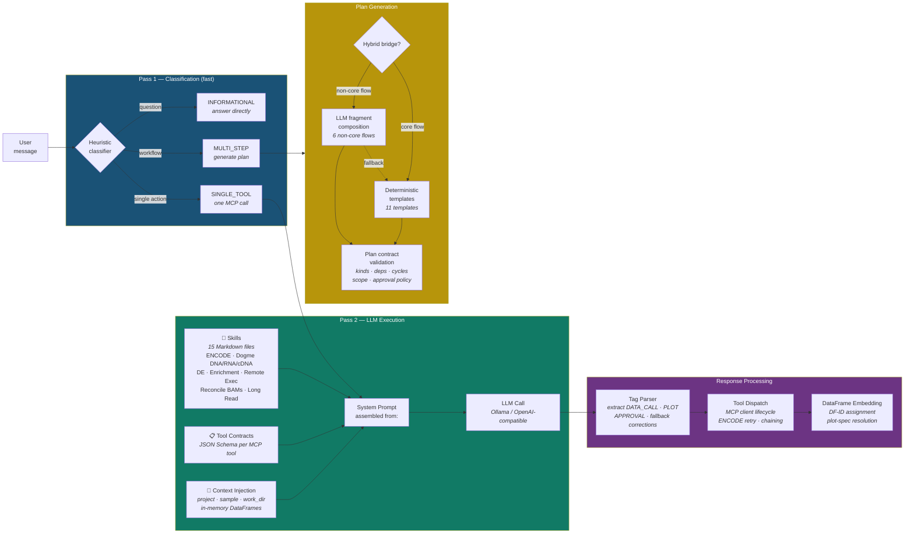

---

## 3. Execution Backend Abstraction & Script Runner

Cortex and the UI are **completely backend-agnostic** — the same
`ExecutionBackend` protocol drives both local Nextflow and remote SLURM
execution. Adding a new backend (e.g., AWS Batch) requires implementing
five methods without touching the rest of the stack.

Since v3.4.6, Launchpad also supports **allowlisted script execution** —
standalone Python utilities (e.g., `reconcile_bams`, `count_bed`) can run
via the `RUN_SCRIPT` plan step kind with a deny-by-default allowlist. Skills
automatically register their `scripts/*.py` at startup.


---

## 4. HPC Remote Execution — 13-Stage Lifecycle

Remote jobs follow a validated state machine with **13 stages** and enforced
transitions. The fail-closed design means results are never marked complete
until outputs are verified locally. Every stage transition is audit-logged.

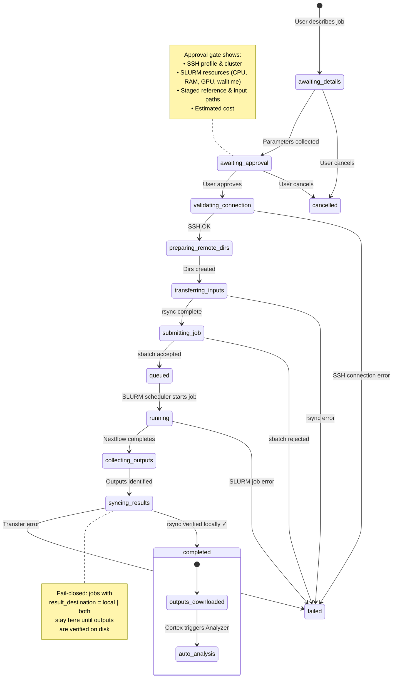

---

## 5. End-to-End Bioinformatics Workflow

A typical AGOUTIC session — from consortium data discovery through pipeline
execution to biological interpretation — all driven by natural-language
conversation. Each arrow is an automated step; diamonds are human approval gates.
Safe discovery steps (LOCATE_DATA, SEARCH_ENCODE, CHECK_EXISTING) now execute
in **parallel batches** via `asyncio.gather()`, while approval-sensitive steps
remain sequential. Failed steps trigger the **replanner**, which marks dependents
as SKIPPED and adds recovery notes.


---

## 6. Security & Multi-Layer Access Control

AGOUTIC enforces security at every layer — from OAuth login through
per-user filesystem jails to credential-free HPC submission.
No raw secrets are ever stored; all sensitive operations require explicit
approval gates.

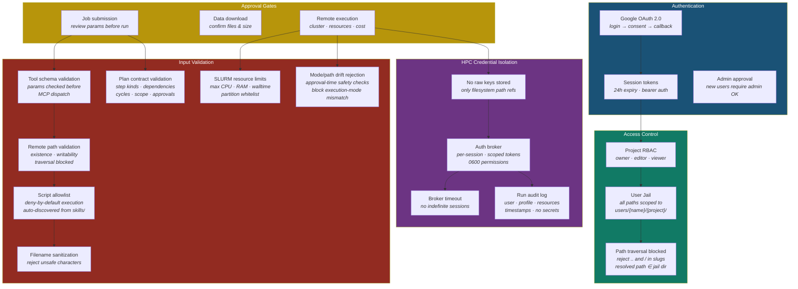

---

## 7. Skill System & Domain Coverage

AGOUTIC's capabilities are encoded as **skills** — human-readable Markdown
files that define domain workflows, valid tool calls, and prompting strategies.
Each skill lives in its own directory (`skills/<key>/SKILL.md`) and can include
embedded Python scripts that execute via the allowlisted script runner.
The skill registry maps every skill to a backend service so the agent knows
where to dispatch tool calls.

```mermaid
graph TB
    subgraph SkillSystem ["Skill System · 15 skills in skills/<key>/SKILL.md"]
        direction TB
        subgraph DataAccess ["Data Access"]
            ES["ENCODE_Search<br/><i>biosample · assay · target<br/>experiment search & filtering</i>"]
            EL["ENCODE_LongRead<br/><i>long-read-specific<br/>ENCODE queries</i>"]
            DL["download_files<br/><i>ENCODE file download<br/>to local project dir</i>"]
        end

        subgraph PipelineExec ["Pipeline Execution"]
            DNA["run_dogme_dna<br/><i>DNA methylation<br/>Nanopore pipeline</i>"]
            RNA["run_dogme_rna<br/><i>RNA-seq / direct RNA<br/>Nanopore pipeline</i>"]
            CDNA["run_dogme_cdna<br/><i>cDNA sequencing<br/>Nanopore pipeline</i>"]
            ALS["analyze_local_sample<br/><i>local sample intake<br/>param collection → submit</i>"]
            RE["remote_execution<br/><i>HPC/SLURM staging<br/>SSH profile · sbatch</i>"]
        end

        subgraph Analysis ["Analysis & Interpretation"]
            AJR["analyze_job_results<br/><i>QC · stats · file parsing<br/>📜 scripts/count_bed.py</i>"]
            DE["differential_expression<br/><i>edgeR via edgePython<br/>volcano · MA plots</i>"]
            ENR["enrichment_analysis<br/><i>GO · pathway enrichment<br/>dot plots</i>"]
            RB["reconcile_bams<br/><i>cross-workflow BAM merge<br/>📜 scripts/reconcile_bams.py<br/>📜 scripts/check_workflow_references.py</i>"]
        end

        WEL["welcome<br/><i>entry point · routing</i>"]

        Shared["shared/<br/><i>DOGME_QUICK_WORKFLOW_GUIDE.md<br/>SKILL_ROUTING_PATTERN.md</i>"]
    end

    subgraph Routing ["Service Routing · get_source_for_skill()"]
        ENCODE_SVC["🧬 ENCODE Portal<br/>port 8006"]
        LP_SVC["🚀 Launchpad<br/>port 8002"]
        AN_SVC["📊 Analyzer<br/>port 8005"]
        EP_SVC["📈 edgePython<br/>port 8007"]
    end

    ES --> ENCODE_SVC
    EL --> ENCODE_SVC
    ALS --> LP_SVC
    RE --> LP_SVC
    RB --> LP_SVC
    DNA --> AN_SVC
    RNA --> AN_SVC
    CDNA --> AN_SVC
    AJR --> AN_SVC
    ENR --> AN_SVC
    DE --> EP_SVC

    style DataAccess fill:#1a5276,color:#fff
    style PipelineExec fill:#117a65,color:#fff
    style Analysis fill:#6c3483,color:#fff
    style Routing fill:#b7950b,color:#fff
```

---

## 8. Conversation Message Lifecycle

How a single user message flows through Cortex — from chat input to persisted
response. The two-pass LLM architecture is visible here: the first pass
generates a plan or tool calls, the second pass summarises real data results.
Each numbered box is a distinct module; no single file handles the full path.

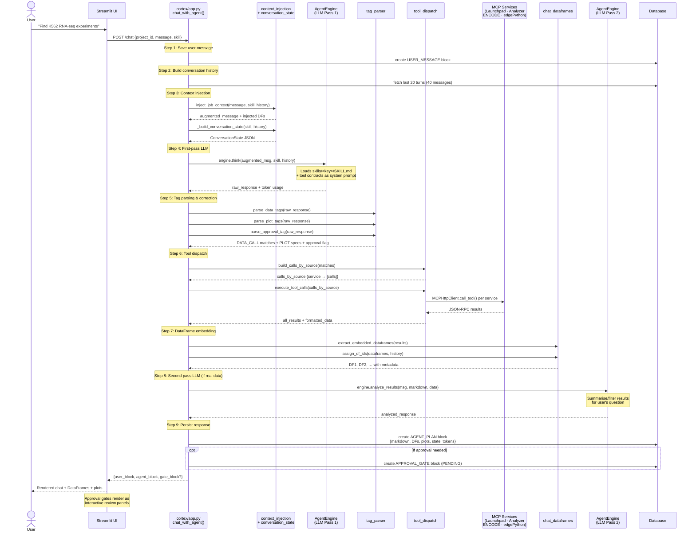

---

*Generated for AGOUTIC v3.4.9 — March 2026*
