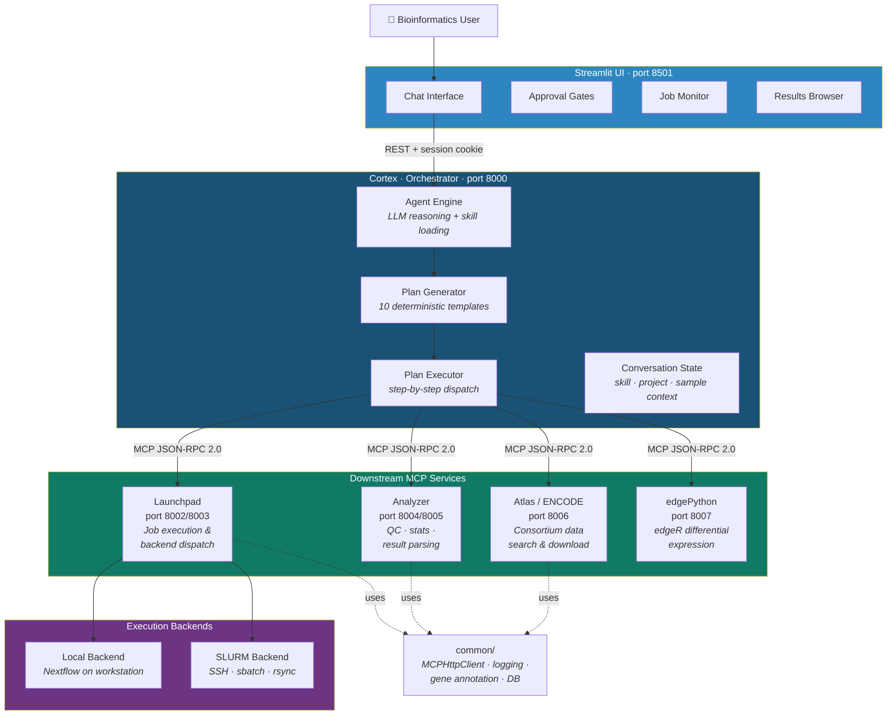
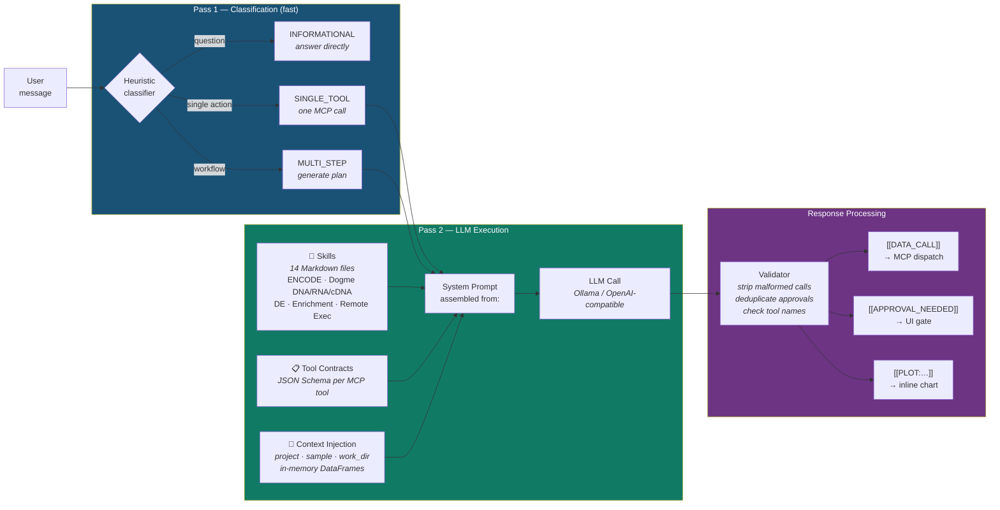
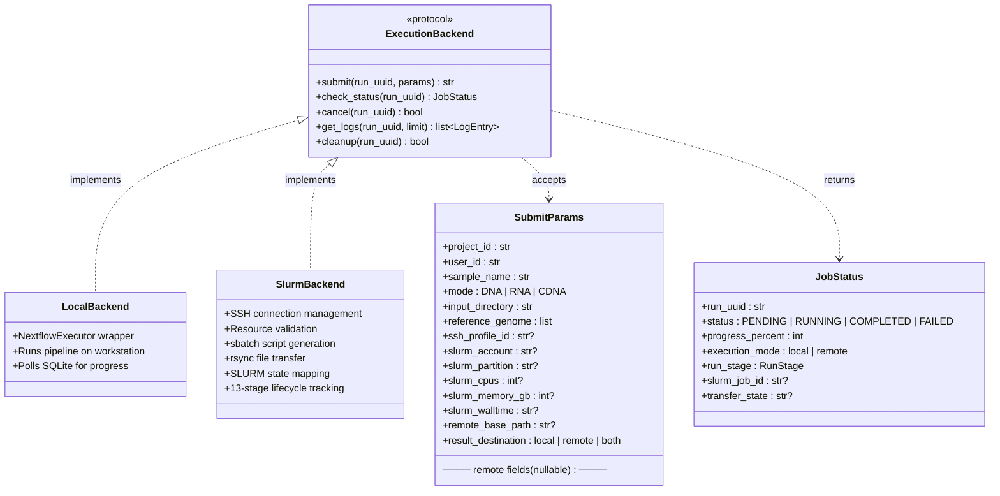
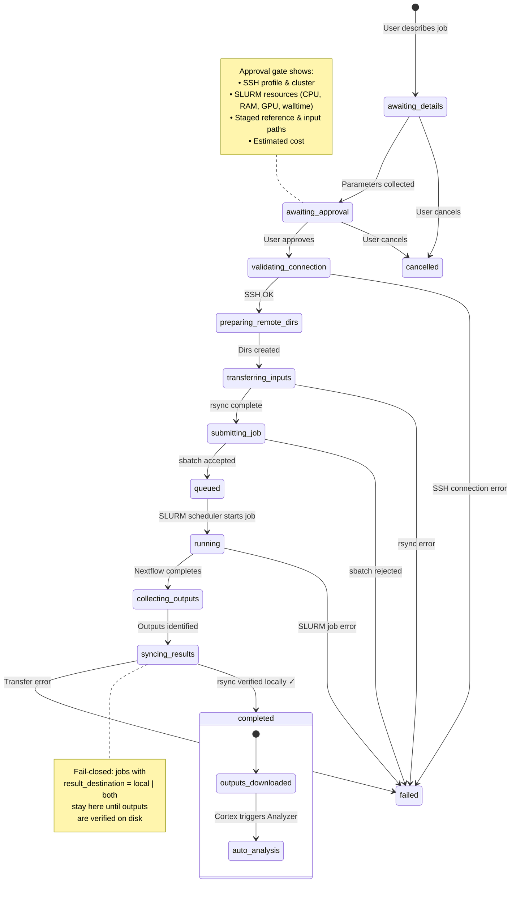
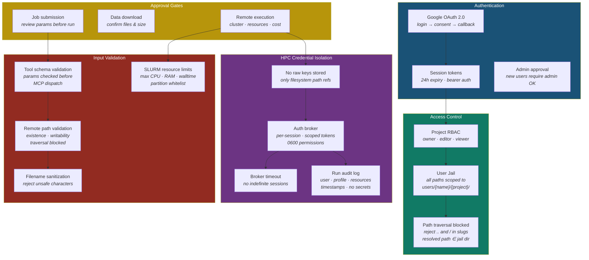

# AGOUTIC Architecture — Visual Overview

> Six diagrams illustrating the architecture of **AGOUTIC v3.4.3**, an agentic
> bioinformatics platform that orchestrates ENCODE data retrieval, Nextflow
> pipeline execution (local & HPC/SLURM), differential expression analysis,
> and gene enrichment through natural-language conversation.

---

## 1. Service Architecture

Five MCP (Model Context Protocol) micro-services communicate over stateless
JSON-RPC 2.0. The Streamlit UI talks exclusively to **Cortex**, which fans out
to specialised backends. No service ever bypasses the orchestrator.

---

## 2. Agent Intelligence — Two-Pass LLM Architecture

The agent uses a **two-pass architecture** that separates fast classification
from careful execution, ensuring the system never improvises on safety-critical
steps. Skill files (Markdown) encode domain workflows; tool contracts give the
LLM precise parameter schemas.

---

## 3. Execution Backend Abstraction

Cortex and the UI are **completely backend-agnostic** — the same
`ExecutionBackend` protocol drives both local Nextflow and remote SLURM
execution. Adding a new backend (e.g., AWS Batch) requires implementing
five methods without touching the rest of the stack.

---

## 4. HPC Remote Execution — 13-Stage Lifecycle

Remote jobs follow a validated state machine with **13 stages** and enforced
transitions. The fail-closed design means results are never marked complete
until outputs are verified locally. Every stage transition is audit-logged.

---

## 5. End-to-End Bioinformatics Workflow

A typical AGOUTIC session — from consortium data discovery through pipeline
execution to biological interpretation — all driven by natural-language
conversation. Each arrow is an automated step; diamonds are human approval gates.

```mermaid
flowchart TB
    Start(["🧬 User: 'Find RNA-seq for<br/>K562, run Dogme RNA<br/>on the cluster, then DE'"])

    subgraph Phase1 ["Data Discovery"]
        Search["Atlas / ENCODE MCP<br/>search_experiments<br/><i>organism · assay · biosample</i>"]
        Browse["Browse results<br/><i>interactive DataFrame in UI</i>"]
        Select["User selects files<br/><i>FASTQ / BAM accessions</i>"]
    end

    DL{"Approve<br/>download?"}

    subgraph Phase2 ["Download & Stage"]
        Download["Download ENCODE files<br/><i>via ENCODE portal URLs</i>"]
        Cache["Cache check<br/><i>reference genome already<br/>staged on cluster?</i>"]
        Stage["Stage inputs to HPC<br/><i>rsync to remote_base_path/<br/>user/project/data/</i>"]
    end

    Submit{"Approve<br/>SLURM<br/>submission?"}

    subgraph Phase3 ["HPC Execution"]
        Validate["Validate SLURM resources<br/><i>CPUs · RAM · walltime · GPUs<br/>partition · account whitelist</i>"]
        Sbatch["Generate & submit sbatch<br/><i>Nextflow + Apptainer<br/>Dogme RNA pipeline</i>"]
        Poll["Monitor SLURM job<br/><i>scontrol / sacct polling<br/>13-stage tracking</i>"]
        Sync["Sync results to local<br/><i>selective rsync: annot/ bams/<br/>bedMethyl/ kallisto/ stats/</i>"]
    end

    subgraph Phase4 ["Analysis & Interpretation"]
        QC["Parse QC & stats<br/><i>Analyzer MCP</i>"]
        DE["Differential expression<br/><i>edgePython MCP · edgeR</i>"]
        Enrich["GO & pathway enrichment<br/><i>Analyzer MCP</i>"]
        Plots["Generate plots<br/><i>volcano · MA · heatmap<br/>enrichment dot plots</i>"]
        Summary["Natural-language summary<br/><i>LLM interprets results</i>"]
    end

    Start --> Search --> Browse --> Select --> DL
    DL -->|Yes| Download --> Cache --> Stage --> Submit
    DL -->|No| Browse

    Submit -->|Yes| Validate --> Sbatch --> Poll --> Sync
    Submit -->|No| Stage

    Sync --> QC --> DE --> Enrich --> Plots --> Summary

    style Phase1 fill:#1a5276,color:#fff
    style Phase2 fill:#117a65,color:#fff
    style Phase3 fill:#6c3483,color:#fff
    style Phase4 fill:#b7950b,color:#fff
```

---

## 6. Security & Multi-Layer Access Control

AGOUTIC enforces security at every layer — from OAuth login through
per-user filesystem jails to credential-free HPC submission.
No raw secrets are ever stored; all sensitive operations require explicit
approval gates.

---

*Generated for AGOUTIC v3.4.3 — March 2026*
