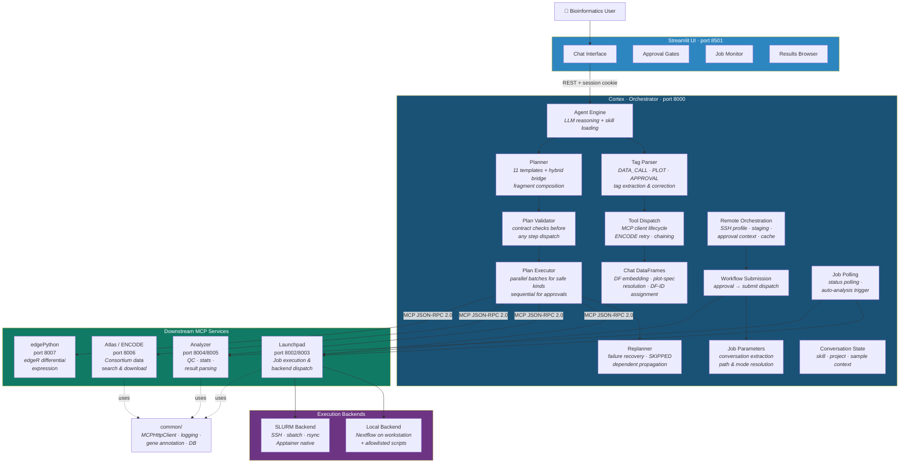
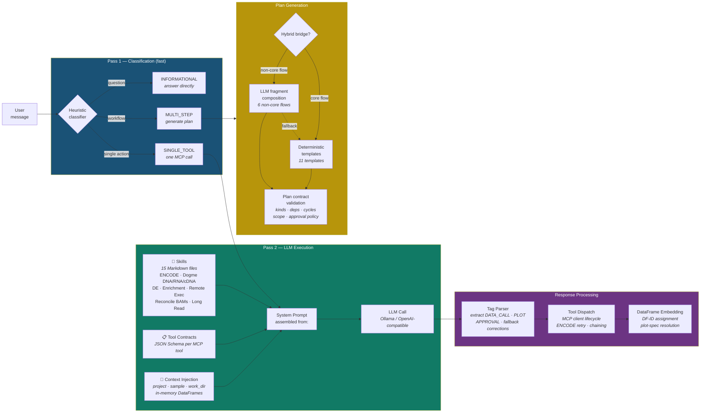
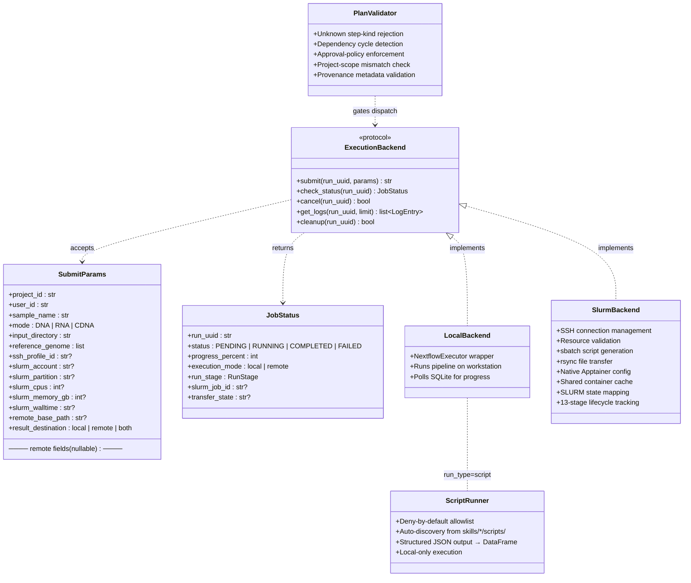
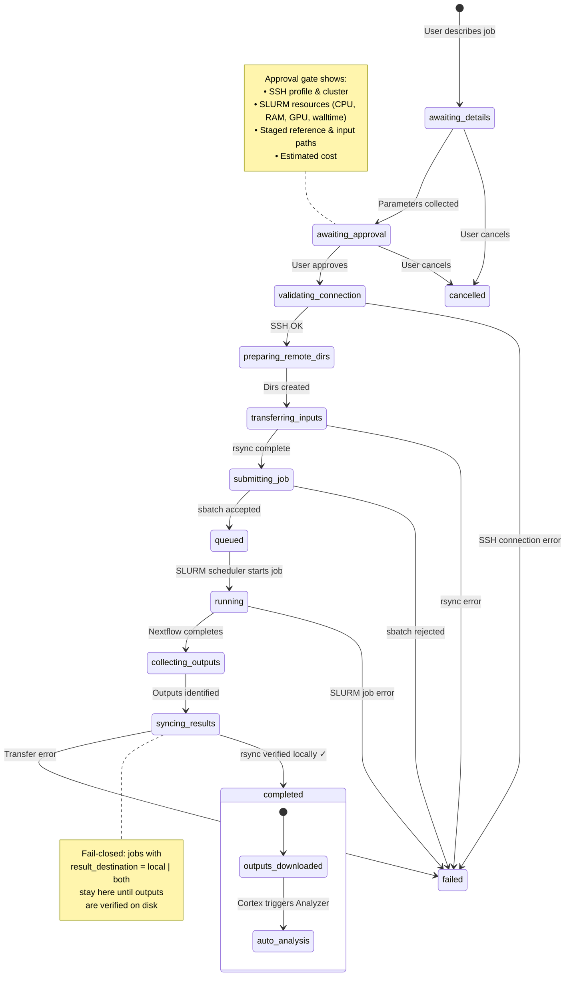
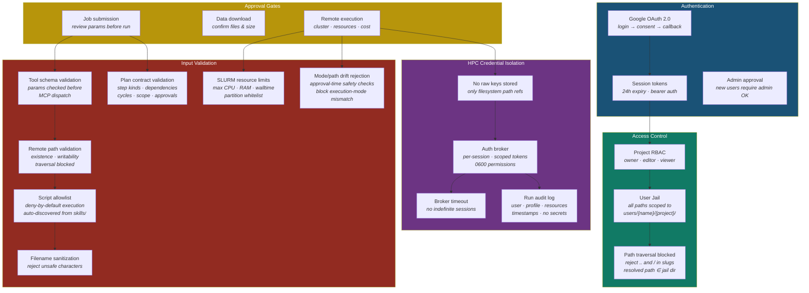
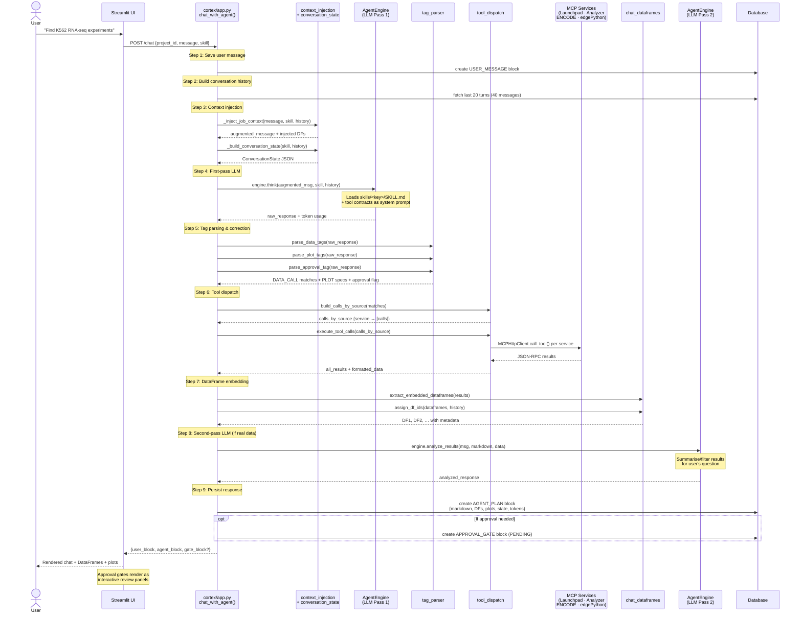

# AGOUTIC Architecture — Visual Overview

> Eight diagrams illustrating the architecture of **AGOUTIC v3.4.9**, an agentic
> bioinformatics platform that orchestrates ENCODE data retrieval, Nextflow
> pipeline execution (local & HPC/SLURM), differential expression analysis,
> and gene enrichment through natural-language conversation.

---

## 1. Service Architecture

Five MCP (Model Context Protocol) micro-services communicate over stateless
JSON-RPC 2.0. The Streamlit UI talks exclusively to **Cortex**, which fans out
to specialised backends. No service ever bypasses the orchestrator. Cortex
itself is decomposed into focused modules — chat orchestration, planning,
execution, tool dispatch, and remote orchestration each live in their own file.

---

## 2. Agent Intelligence — Two-Pass LLM Architecture

The agent uses a **two-pass architecture** that separates fast classification
from careful execution, ensuring the system never improvises on safety-critical
steps. Skill files (Markdown) encode domain workflows in a per-skill directory
layout (`skills/<key>/SKILL.md`); tool contracts give the LLM precise parameter
schemas. Multi-step requests now go through a **hybrid planning bridge** that
attempts LLM fragment composition first for six non-core flows, falling back to
deterministic templates on failure.

---

## 3. Execution Backend Abstraction & Script Runner

Cortex and the UI are **completely backend-agnostic** — the same
`ExecutionBackend` protocol drives both local Nextflow and remote SLURM
execution. Adding a new backend (e.g., AWS Batch) requires implementing
five methods without touching the rest of the stack.

Since v3.4.6, Launchpad also supports **allowlisted script execution** —
standalone Python utilities (e.g., `reconcile_bams`, `count_bed`) can run
via the `RUN_SCRIPT` plan step kind with a deny-by-default allowlist. Skills
automatically register their `scripts/*.py` at startup.

---

## 4. HPC Remote Execution — 13-Stage Lifecycle

Remote jobs follow a validated state machine with **13 stages** and enforced
transitions. The fail-closed design means results are never marked complete
until outputs are verified locally. Every stage transition is audit-logged.

---

## 5. End-to-End Bioinformatics Workflow

A typical AGOUTIC session — from consortium data discovery through pipeline
execution to biological interpretation — all driven by natural-language
conversation. Each arrow is an automated step; diamonds are human approval gates.
Safe discovery steps (LOCATE_DATA, SEARCH_ENCODE, CHECK_EXISTING) now execute
in **parallel batches** via `asyncio.gather()`, while approval-sensitive steps
remain sequential. Failed steps trigger the **replanner**, which marks dependents
as SKIPPED and adds recovery notes.

```mermaid
flowchart TB
    Start(["🧬 User: 'Find RNA-seq for<br/>K562, run Dogme RNA<br/>on the cluster, then DE'"])

    subgraph Phase1 ["Data Discovery (parallel batch)"]
        Search["Atlas / ENCODE MCP<br/>search_experiments<br/><i>organism · assay · biosample</i>"]
        Browse["Browse results<br/><i>interactive DataFrame in UI</i>"]
        Select["User selects files<br/><i>FASTQ / BAM accessions</i>"]
    end

    DL{"Approve<br/>download?"}

    subgraph Phase2 ["Download & Stage"]
        Download["Download ENCODE files<br/><i>via ENCODE portal URLs</i>"]
        Cache["Cache check<br/><i>reference genome already<br/>staged on cluster?</i>"]
        Stage["Stage inputs to HPC<br/><i>rsync to remote_base_path/<br/>user/project/data/</i>"]
    end

    Submit{"Approve<br/>SLURM<br/>submission?"}

    subgraph Phase3 ["HPC Execution"]
        Validate["Validate SLURM resources<br/><i>CPUs · RAM · walltime · GPUs<br/>partition · account whitelist</i>"]
        Sbatch["Generate & submit sbatch<br/><i>Nextflow + native Apptainer<br/>shared container cache</i>"]
        Poll["Monitor SLURM job<br/><i>scontrol / sacct polling<br/>13-stage tracking</i>"]
        Sync["Sync results to local<br/><i>selective rsync: annot/ bams/<br/>bedMethyl/ kallisto/ stats/</i>"]
    end

    subgraph Phase4 ["Analysis & Interpretation"]
        QC["Parse QC & stats<br/><i>Analyzer MCP</i>"]
        Reconcile["Reconcile BAMs<br/><i>allowlisted script<br/>cross-workflow merge</i>"]
        DE["Differential expression<br/><i>edgePython MCP · edgeR</i>"]
        Enrich["GO & pathway enrichment<br/><i>Analyzer MCP</i>"]
        Plots["Generate plots<br/><i>volcano · MA · heatmap<br/>BED chr counts · enrichment</i>"]
        Summary["Natural-language summary<br/><i>LLM interprets results</i>"]
    end

    subgraph Recovery ["Failure Recovery"]
        Replanner["Replanner<br/><i>mark dependents SKIPPED<br/>add recovery notes</i>"]
    end

    Start --> Search --> Browse --> Select --> DL
    DL -->|Yes| Download --> Cache --> Stage --> Submit
    DL -->|No| Browse

    Submit -->|Yes| Validate --> Sbatch --> Poll --> Sync
    Submit -->|No| Stage

    Sync --> QC --> Reconcile --> DE --> Enrich --> Plots --> Summary

    Validate -.->|failure| Replanner
    Poll -.->|failure| Replanner
    Sync -.->|failure| Replanner

    style Phase1 fill:#1a5276,color:#fff
    style Phase2 fill:#117a65,color:#fff
    style Phase3 fill:#6c3483,color:#fff
    style Phase4 fill:#b7950b,color:#fff
    style Recovery fill:#922b21,color:#fff
```

---

## 6. Security & Multi-Layer Access Control

AGOUTIC enforces security at every layer — from OAuth login through
per-user filesystem jails to credential-free HPC submission.
No raw secrets are ever stored; all sensitive operations require explicit
approval gates.

---

## 7. Skill System & Domain Coverage

AGOUTIC's capabilities are encoded as **skills** — human-readable Markdown
files that define domain workflows, valid tool calls, and prompting strategies.
Each skill lives in its own directory (`skills/<key>/SKILL.md`) and can include
embedded Python scripts that execute via the allowlisted script runner.
The skill registry maps every skill to a backend service so the agent knows
where to dispatch tool calls.

```mermaid
graph TB
    subgraph SkillSystem ["Skill System · 15 skills in skills/<key>/SKILL.md"]
        direction TB
        subgraph DataAccess ["Data Access"]
            ES["ENCODE_Search<br/><i>biosample · assay · target<br/>experiment search & filtering</i>"]
            EL["ENCODE_LongRead<br/><i>long-read-specific<br/>ENCODE queries</i>"]
            DL["download_files<br/><i>ENCODE file download<br/>to local project dir</i>"]
        end

        subgraph PipelineExec ["Pipeline Execution"]
            DNA["run_dogme_dna<br/><i>DNA methylation<br/>Nanopore pipeline</i>"]
            RNA["run_dogme_rna<br/><i>RNA-seq / direct RNA<br/>Nanopore pipeline</i>"]
            CDNA["run_dogme_cdna<br/><i>cDNA sequencing<br/>Nanopore pipeline</i>"]
            ALS["analyze_local_sample<br/><i>local sample intake<br/>param collection → submit</i>"]
            RE["remote_execution<br/><i>HPC/SLURM staging<br/>SSH profile · sbatch</i>"]
        end

        subgraph Analysis ["Analysis & Interpretation"]
            AJR["analyze_job_results<br/><i>QC · stats · file parsing<br/>📜 scripts/count_bed.py</i>"]
            DE["differential_expression<br/><i>edgeR via edgePython<br/>volcano · MA plots</i>"]
            ENR["enrichment_analysis<br/><i>GO · pathway enrichment<br/>dot plots</i>"]
            RB["reconcile_bams<br/><i>cross-workflow BAM merge<br/>📜 scripts/reconcile_bams.py<br/>📜 scripts/check_workflow_references.py</i>"]
        end

        WEL["welcome<br/><i>entry point · routing</i>"]

        Shared["shared/<br/><i>DOGME_QUICK_WORKFLOW_GUIDE.md<br/>SKILL_ROUTING_PATTERN.md</i>"]
    end

    subgraph Routing ["Service Routing · get_source_for_skill()"]
        ENCODE_SVC["🧬 ENCODE Portal<br/>port 8006"]
        LP_SVC["🚀 Launchpad<br/>port 8002"]
        AN_SVC["📊 Analyzer<br/>port 8005"]
        EP_SVC["📈 edgePython<br/>port 8007"]
    end

    ES --> ENCODE_SVC
    EL --> ENCODE_SVC
    ALS --> LP_SVC
    RE --> LP_SVC
    RB --> LP_SVC
    DNA --> AN_SVC
    RNA --> AN_SVC
    CDNA --> AN_SVC
    AJR --> AN_SVC
    ENR --> AN_SVC
    DE --> EP_SVC

    style DataAccess fill:#1a5276,color:#fff
    style PipelineExec fill:#117a65,color:#fff
    style Analysis fill:#6c3483,color:#fff
    style Routing fill:#b7950b,color:#fff
```

---

## 8. Conversation Message Lifecycle

How a single user message flows through Cortex — from chat input to persisted
response. The two-pass LLM architecture is visible here: the first pass
generates a plan or tool calls, the second pass summarises real data results.
Each numbered box is a distinct module; no single file handles the full path.

---

*Generated for AGOUTIC v3.4.9 — March 2026*
